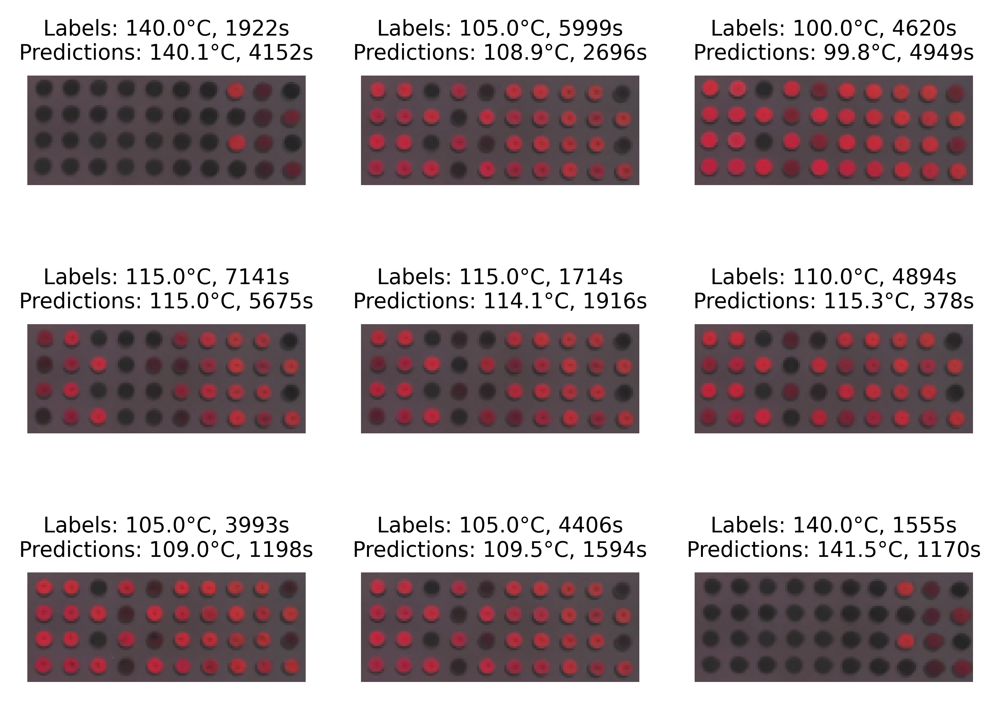

## Deep learning-enabled readout of photonic crystal sensors

### Overview

This is an unofficial, non-peer reviewed, closer examination of the data presented on time-temperature integrating
photonic crystal arrays published in
[_Advanced Optical Materials_](https://doi.org/10.1002/advs.202205512), by _M. Schoettle*, T. Tran*, H. Oberhofer, and
M. Retsch (*equal contribution)_ which was part of my doctoral thesis. These self-assembled colloidal materials act as
photonic sensors that allow a detailed evaluation of the thermal history and independent derivation of both time and
temperature. The dataset, comprising digital photographs of the sensors obtained at elevated temperatures, is obtained
from the [online repository](https://zenodo.org/records/7464047).

Here, convolutional neural networks are used to infer time and temperature. The focus is set on comparing results
obtained with a custom network, to those of a fine-tuned, pretrained model.

### Usage

- Download and unpack the dataset. Specify the filepath in a .env file as ```RAW_DATA_PATH="./your_file_path"```
- Open the directory _0_data_preprocessing_. Run _train_cv_test_split.py_ after specifying train, cv, and test
  fractions.
- Open the directory _1_custom_model_. Run _train.py_ after specifying all hyperparameters. The output, including loss
  curves, predictions, model state dictionary, and hyperparameter dictionary will be saved in a
  subdirectory titled _model_results_.
- Open the directory _2_pretrained_model_. Run _train.py_ after specifying all hyperparameters. If the foundation model
  is changed, this also requires adjustment of the specified weights. The output format is analogous to that of the
  custom
  model.

### Example of a possible result

Predictions on a random subset of the test data:



### Prerequisites

- Python 3.9+
- Dependencies listed in pyproject.toml